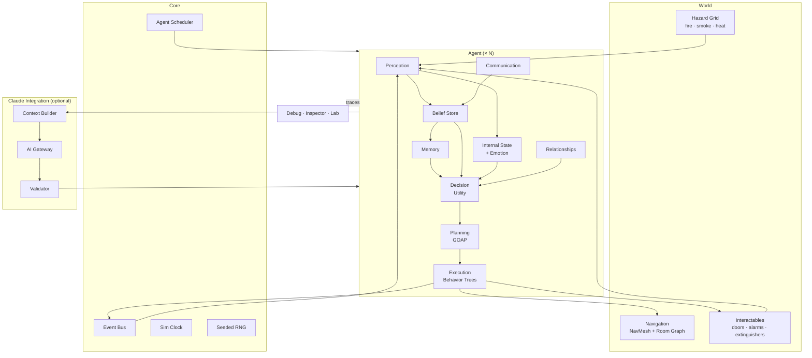
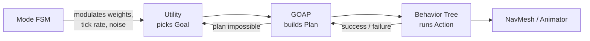
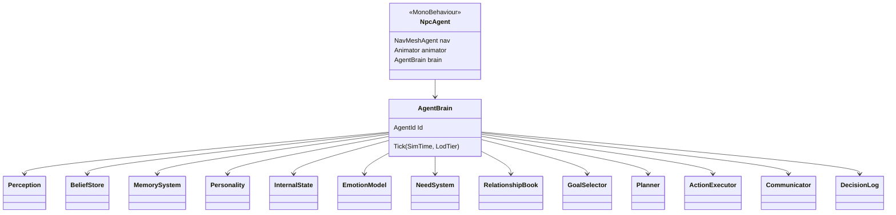
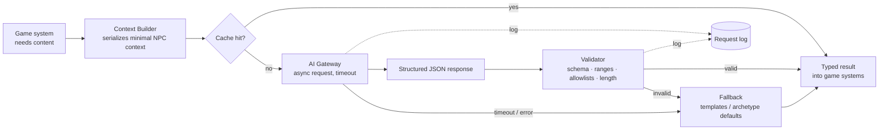
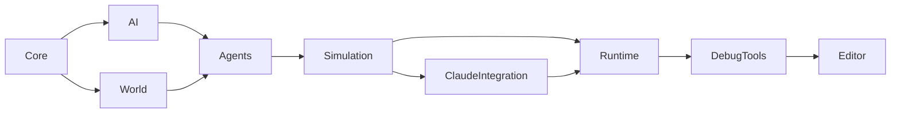

# Cascade — Architecture

> Cascade is an experimental Unity project focused on building autonomous NPCs capable of perception, memory, personality, social interaction, planning and adaptive decision-making.

This document describes how the agent architecture is structured, which technique owns which level of decision, how data flows through an agent, and why each major design choice was made. It is the reference for anyone writing code in the repository.

Status: **living document**. Sections marked *(Phase N)* describe systems that are designed but not yet implemented.

---

## Table of contents

1. [Scope](#1-scope)
2. [Design principles](#2-design-principles)
3. [System overview](#3-system-overview)
4. [Decision architecture: who controls what](#4-decision-architecture-who-controls-what)
5. [Agent anatomy](#5-agent-anatomy)
6. [The agent update pipeline](#6-the-agent-update-pipeline)
7. [Subsystems](#7-subsystems)
8. [Core services](#8-core-services)
9. [World](#9-world)
10. [Claude integration](#10-claude-integration)
11. [Scheduling and performance](#11-scheduling-and-performance)
12. [Observability and debugging](#12-observability-and-debugging)
13. [Project layout and assemblies](#13-project-layout-and-assemblies)
14. [Testing strategy](#14-testing-strategy)
15. [Architecture decision log](#15-architecture-decision-log)
16. [Known limitations and open questions](#16-known-limitations-and-open-questions)

---

## 1. Scope

Cascade is a **laboratory for autonomous game agents**. The building-fire scenario exists to stress the agents; it is not the product.

Priorities, in order:

```
NPC Intelligence  >  Gameplay  >  Graphics
```

Out of scope for now: multiplayer, procedural building generation, realistic fire physics, realistic human psychology. Emotions and personality are **gameplay abstractions**, chosen because they are controllable, explainable and cheap.

---

## 2. Design principles

These rules take precedence over convenience. If a change violates one, it needs an entry in the [decision log](#15-architecture-decision-log).

**P1 — Agents act on beliefs, never on world truth.**
Every decision reads from the agent's own `BeliefStore`. Only the perception, memory and communication systems write to it. No decision code may query the world directly (no `FindObjectsOfType`, no global hazard lists). This single rule is what makes partial knowledge, rumors, outdated information and knowledge propagation real rather than simulated.

**P2 — Simulation logic is plain C#; MonoBehaviours are thin adapters.**
The brain of an agent (`AgentBrain` and its components) has no dependency on `MonoBehaviour`. It can be constructed, ticked and asserted on in an EditMode test without a scene. `NpcAgent` (the MonoBehaviour) only wires the brain to NavMesh, Animator and Transform.

**P3 — Composition over a god class.**
There is no `NPCController`. An agent is a composition root that owns independent components (perception, beliefs, memory, internal state, …) communicating through well-defined interfaces and the agent-local blackboard.

**P4 — Every decision is explainable.**
Any decision the agent makes produces a `DecisionTrace` recording the options considered, every factor that scored them, and why the winner won. If a behavior cannot be explained from its trace, it is a bug, not emergence.

**P5 — Behavior emerges from few, general primitives.**
We add *considerations* (reusable scoring factors) and *actions* (reusable capabilities), not scripted situations. A new behavior should ideally appear from new data (personality, memory, beliefs), not from new `if` branches.

**P6 — Real time never waits on Claude.**
The game is fully playable and fully autonomous with the network disabled. Claude output is validated data that enriches agents; it never drives per-frame behavior and never executes code.

**P7 — Reproducibility.**
All randomness comes from seeded RNG streams, and all systems use simulation time rather than `Time.time`. A run is reproducible from `(scenario, seed, recorded player inputs)`. Emergent behavior that cannot be reproduced cannot be debugged.

**P8 — Incremental and testable.**
Every phase ends in something observable in the Simulation Lab. We do not build infrastructure for a phase that is not being worked on.

---

## 3. System overview



Arrows show the direction data flows. Note that `World` feeds the agent **only** through `Perception` (P1).

---

## 4. Decision architecture: who controls what

The spec lists Utility AI, Behavior Trees, FSMs, HSMs, GOAP and influence maps. Each is used for exactly one job:

| Layer | Question it answers | Technique | Frequency | Owner |
|---|---|---|---|---|
| **Mode** | "What state of mind am I in?" | Thin FSM derived from internal state (Calm → Alert → Afraid → Panicked, …) | On state change | `EmotionModel` |
| **Goal selection** | "What do I want right now?" | **Utility AI** | Decision tick (0.25–2 s by LOD) + interrupts | `GoalSelector` |
| **Planning** | "How do I achieve it?" | **GOAP** over a small symbolic state *(Phase 5; fixed method lists before that)* | On goal change or plan invalidation | `Planner` |
| **Execution** | "How do I perform this step?" | **Behavior Trees** (one small tree per action) | Every agent tick | `ActionExecutor` |
| **Spatial reasoning** | "Where is safe / dangerous / useful?" | Room graph with per-agent costs + hazard grid (an influence map) | Sampled on demand | `RouteEvaluator` |
| **Locomotion** | "How do I physically get there?" | Unity NavMesh | Every frame (Unity) | `NavMeshAgent` |



### Why this split

- **Utility at the top** because goal choice is where personality, emotion, memory and relationships must be weighed *continuously* against each other. Utility turns "two NPCs react differently to the same fire" into different numbers, and those numbers are exactly what the debugger shows.
- **GOAP in the middle** because once a goal is chosen, the sequence of steps depends on beliefs (door believed locked → find key or another route). Hand-authoring all of those as trees is the combinatorial explosion we want to avoid. GOAP stays cheap because its state is small and replanning is event-driven.
- **Behavior Trees at the bottom** because executing an action ("open door": walk, face, play animation, wait, check result, time out) is sequential, reactive and well suited to trees. Trees here are small (5–15 nodes) and never make strategic choices.
- **The FSM is deliberately thin.** It does not select behavior. It *modulates* the layers below: in `Panicked`, decisions tick faster, selection noise rises, some goals are masked and planning depth shrinks. "Freezing" emerges from this instead of being scripted.

**Rule:** a layer may only influence the layer directly below it and report results to the layer directly above it. A Behavior Tree never changes the goal; it fails, and the failure propagates upward.

---

## 5. Agent anatomy



```csharp
// Plain C#. No MonoBehaviour. Constructed by NpcAgent or directly in tests.
public sealed class AgentBrain
{
    public AgentId Id { get; }

    public Perception      Perception    { get; }
    public BeliefStore     Beliefs       { get; }
    public MemorySystem    Memory        { get; }
    public Personality     Personality   { get; }
    public InternalState   State         { get; }
    public EmotionModel    Emotion       { get; }
    public NeedSystem      Needs         { get; }
    public RelationshipBook Relationships { get; }
    public GoalSelector    Goals         { get; }
    public Planner         Planner       { get; }
    public ActionExecutor  Executor      { get; }
    public Communicator    Comms         { get; }
    public DecisionLog     Log           { get; }

    public AgentBrain(AgentId id, AgentProfile profile, ISimulationContext sim, IAgentBody body) { /* compose */ }

    public void Tick(in TickInfo tick) { /* see section 6 */ }
}

// What the brain needs from the physical world, implemented by NpcAgent.
// Lets tests use a fake body with no scene.
public interface IAgentBody
{
    Vector3 Position { get; }
    Vector3 Forward  { get; }
    bool    IsMoving { get; }
    void    MoveTo(Vector3 destination, float speedFactor);
    void    Stop();
    void    PlayGesture(GestureId gesture);
}
```

`ISimulationContext` gives the brain access to shared services (clock, event bus, RNG stream, spatial index, hazard sampler) without singletons. There is exactly one per running simulation, which is what lets the Simulation Lab reset a run cleanly.

---

## 6. The agent update pipeline

An agent tick runs in a fixed order. Each stage reads the output of the previous one within the same tick, so the order is part of the contract.

```
1. Sense          Perception samples sensors → Percepts
2. Believe        Percepts + received messages → BeliefStore updates
3. Remember       Significant belief changes → Episodic memories
4. Appraise       Events → InternalState deltas → Emotion re-derived
5. Relate         Social events → Relationship updates
6. Decide*        Utility scores goals → maybe switch goal       (*only on decision tick or interrupt)
7. Plan*          If goal changed or plan invalid → replan
8. Execute        Advance current action's Behavior Tree
9. Communicate    Outgoing messages (warnings, requests, info)
10. Trace         Append DecisionTrace / state snapshot for the debugger
```

**Interrupts.** Stages 6–7 normally run on the agent's decision tick, but certain belief changes raise an interrupt that forces them on the next agent tick: a new hazard within a threshold distance, the current route becoming believed-blocked, being directly addressed by another agent, or being injured. Interrupts are what make agents feel reactive while keeping decision cost low.

---

## 7. Subsystems

### 7.1 Perception

Perception converts world stimuli into **percepts**: timestamped, uncertain observations.

| Sensor | Mechanism | Notes |
|---|---|---|
| Vision | Cone test via spatial hash → line-of-sight raycasts (batched with `RaycastCommand`) | Range and FOV reduced by smoke density at the eye's cell |
| Hearing | Sound events on the event bus with position and loudness | Attenuated by distance and closed doors (room graph) |
| Environment | Samples the hazard grid at and around the agent | Heat, smoke density; no line of sight needed |
| Social | Messages from other agents via `Communicator` | Handled as percepts with a `source` |

```csharp
public readonly struct Percept
{
    public readonly PerceptKind Kind;     // SawFire, HeardAlarm, SawAgent, SmelledSmoke, SawBlockedDoor, ...
    public readonly EntityId    Subject;  // what/who was perceived
    public readonly Vector3     Position;
    public readonly float       Confidence; // 0..1, lowered by distance, smoke, peripheral vision, stress
    public readonly SimTime     Time;
}
```

Stress feeds back into perception: high `Stress` narrows the effective vision cone and lowers percept confidence ("tunnel vision"). This is one of the main channels through which emotion changes behavior without dedicated scripts.

### 7.2 Belief store (world knowledge)

The belief store is the agent's model of the world, and the **only** world data decision code may read.

```csharp
public sealed class Belief
{
    public FactKey  Key;          // e.g. ExitStatus(exit_02), HazardAt(room_3), AgentLocation(npc_17)
    public FactValue Value;       // e.g. Blocked, Fire(intensity 0.7), Room(4)
    public float    Confidence;   // 0..1
    public SimTime  LastUpdated;
    public BeliefSource Source;   // Perceived | ToldBy(agentId) | Inferred | Prior
}
```

Rules:

- **Update policy.** A new observation replaces an existing belief when it is newer *and* its confidence is not much lower. Direct perception always outranks hearsay about the same fact at the same time.
- **Decay.** Confidence decays over time at a rate that depends on the fact type (a fire location goes stale in minutes; a floor plan never does).
- **Hearsay.** Information received from another agent enters with `confidence × trust(sender)`. This is where relationships directly shape knowledge.
- **Priors.** Agents start with priors from their profile: a visitor knows only the entrance they used; an employee knows every exit.

### 7.3 Memory *(Phase 3)*

Memory is split into two stores with different jobs.

**Episodic memory** stores events that happened to or around the agent:

```csharp
public sealed class EpisodicMemory
{
    public MemoryKind Kind;       // WasHelpedBy, WasAbandonedBy, RouteWasDangerous, DoorWasLocked, WitnessedInjury, ...
    public EntityId   Subject;    // who or what it is about
    public PlaceId    Place;      // room / route segment
    public SimTime    Time;
    public float      Valence;    // -1 (bad) .. +1 (good)
    public float      Intensity;  // 0..1, how salient it was when stored
    public BeliefSource Source;   // experienced vs. told
}
```

**Semantic knowledge** is what the agent concludes from episodes, for example "Route A is dangerous" or "the player helps people". Consolidation turns repeated or intense episodes into semantic facts, which are cheaper to query and are what most considerations read.

**Relevance** of a memory at query time:

```
relevance = intensity × recencyDecay(now − time) × contextMatch(query)
```

Memory is bounded per agent (e.g. 64 episodes). When full, the least relevant episode is forgotten, after being consolidated if it contributed to a semantic fact.

**Memory must have behavioral impact.** Every memory kind must be read by at least one consideration, route cost or relationship update. A memory kind with no reader is not merged. Example of the loop required by the spec:

```
Agent takes Route A → hazard perceived on Route A
  → EpisodicMemory(RouteWasDangerous, place: route_A, intensity 0.8)
  → consolidated: Knowledge(route_A.danger = 0.8)
  → RouteEvaluator adds cost to route_A for this agent
  → next decision, "Escape via Route A" scores lower
```

### 7.4 Personality

Personality is **static** for the duration of a run. Traits are floats in `[0, 1]`:

`Courage, Fearfulness, Leadership, Empathy, Curiosity, Aggression, Trust (baseline), RiskTolerance, Patience, Independence`

- Authored as `PersonalityArchetype` ScriptableObjects (e.g. *Protector*, *Loner*, *Anxious*, *Organizer*), each with a mean and variance per trait. Each spawned agent samples from its archetype with its own RNG stream, so two "Anxious" NPCs are not identical.
- Personality **never selects behavior directly.** It acts through three channels only:
  1. **Consideration weights**: High `Empathy` raises the weight of "others need help" in `HelpOther`.
  2. **Internal state dynamics**: High `Fearfulness` makes `Fear` rise faster and decay slower; high `Patience` slows `Stress` accumulation.
  3. **Thresholds**: `RiskTolerance` shifts the curve that converts perceived danger into utility penalty.

Keeping personality to these channels is what makes its influence visible and tunable in the debugger.

### 7.5 Internal state and emotion

**Internal state** is a set of continuous variables in `[0, 1]` that change over time:

`Stress, Fear, Energy, Health, Confidence, Awareness, Curiosity, Aggression, SocialNeed`

Each variable has a personality-dependent baseline and decay rate. Events apply deltas through an **appraisal** table (data-driven, ScriptableObject):

| Event | Stress | Fear | Confidence | Awareness |
|---|---|---|---|---|
| Heard alarm | +0.15 | +0.10 | | +0.40 |
| Saw fire (close) | +0.30 | +0.35 | −0.10 | +0.30 |
| Route believed blocked | +0.20 | +0.10 | −0.15 | |
| Helped by someone | −0.10 | −0.10 | +0.10 | |
| Reached safe zone | −0.40 | −0.40 | +0.20 | |

Deltas are multiplied by personality sensitivities before being applied.

**Emotion is derived, not stored independently.** The discrete emotional state shown in the UI (`Calm, Nervous, Afraid, Panicked, Confident, Angry, Confused, Relieved`) is a classification of the continuous variables, with **hysteresis** so it does not flicker at boundaries:

```
Panicked  ← enter: Fear > 0.85 && Stress > 0.80     exit: Fear < 0.65
Confused  ← enter: Awareness > 0.5 && belief conflicts high && Confidence < 0.3
Relieved  ← enter: large Fear drop within last N seconds
...
```

The emotional state modulates the other systems through a small, explicit table. This is the "Mode" layer from section 4:

| Emotion | Decision interval | Selection noise | Masked goals | Planning depth | Perception |
|---|---|---|---|---|---|
| Calm | ×1.0 | low | — | full | normal |
| Afraid | ×0.7 | medium | Explore | full | −10% FOV |
| Panicked | ×0.4 | high | Explore, HelpOther (unless bonded) | 2 steps | −35% FOV |
| Confused | ×1.3 | medium | — | full | normal |

### 7.6 Needs

Needs express *how much* something matters right now, independent of which goal satisfies it:

`Safety, Survival, SocialConnection, Information, Rest, Assistance, Escape, ProtectOthers`

Each need is recomputed from beliefs and internal state (for example, `Information` is high when `Awareness` is high but beliefs about hazards have low confidence). Goals declare which needs they satisfy; a goal's utility includes the urgency of the needs it serves. This is how context changes priorities without per-situation rules.

### 7.7 Goals

Goals are organized in three horizons:

| Horizon | Example | Lifetime | Chosen by |
|---|---|---|---|
| Long-term | Find family member | Whole run, from profile | Profile / Claude generation |
| Medium-term | Reach evacuation zone | Minutes | Utility, biased by long-term goal |
| Short-term | Find safe route out of this room | Seconds | Planner (as plan steps) |

The long-term goal does not compete in utility selection. Instead it adds a **bias** to medium-term goals that advance it. An agent whose long-term goal is "find my daughter" gets a bonus on `SearchArea(room of last known location)` that can outweigh `Evacuate` until fear gets high enough. That tension is a major source of emergent behavior.

### 7.8 Utility AI (goal selection)

Each candidate goal is a `GoalOption` with a list of considerations. A consideration maps one input to a score in `[0, 1]` through a response curve.

```csharp
public interface IConsideration
{
    string Name { get; }
    float Evaluate(in DecisionContext ctx);   // must return [0, 1]
}

public sealed class CurveConsideration : IConsideration
{
    public string Name { get; }
    private readonly IInput _input;           // e.g. BelievedDangerAtCurrentRoom, NearestKnownExitDistance, TrustIn(target)
    private readonly ResponseCurve _curve;    // linear, quadratic, logistic, ... authored in ScriptableObject
    public float Evaluate(in DecisionContext ctx) => _curve.Evaluate(_input.Read(ctx));
}
```

**Scoring.** Considerations are multiplied (any zero vetoes the option), with a compensation factor so options with many considerations are not unfairly punished:

```
modification = 1 − 1/n
for each consideration score s:
    s' = s + (1 − s) × modification × s
score = weight × Π s'  × personalityMultiplier × needUrgency × longTermBias
```

**Stability.** The currently active goal receives an **inertia bonus** (e.g. +15%) that decays as the goal runs. Without it, agents dither between near-equal options.

**Selection.** The agent does not always take the argmax. It picks among options within a margin of the best, using a softmax whose temperature comes from the emotional state (calm agents are consistent; panicked agents are erratic). The RNG is the agent's seeded stream (P7).

**Targets.** Goals that act on an entity (`HelpOther`, `Follow`, `WarnOther`) are scored **per target**: `HelpOther(npc_12)` and `HelpOther(npc_31)` are separate options, so relationships and memory about each target matter.

Initial goal set (kept small on purpose):

`Evacuate, SeekSafety, HelpOther(t), Follow(t), SearchFor(t), Investigate(place), WarnOther(t), GatherGroup, FightFire, Hide, Wait`

### 7.9 Planning *(GOAP in Phase 5)*

The planner turns a goal into a sequence of actions using a small **symbolic world state** extracted from beliefs:

```
atRoom=3, doorOpen[d4]=unknown, exitBlocked[e1]=true, hasItem[extinguisher]=false,
target[npc_12].room=5, target[npc_12].following=false
```

- Actions declare preconditions, effects and a cost. **Costs are agent-specific**: a route action's cost includes the agent's believed danger and memory of that route, so two agents with the same goal plan different paths.
- Search is A* with a node budget (e.g. 200 expansions). If the budget runs out, the planner returns the best partial plan and marks the goal as "struggling", which lowers its utility next tick.
- **Replan triggers:** goal changed, a step failed, or a belief used in a precondition changed. There is no periodic replanning.
- **Before Phase 5**, each goal has a fixed ordered list of methods (a lightweight HTN). The planner interface is the same, so switching to GOAP does not touch the other layers.

### 7.10 Actions and execution

An action is a capability with a Behavior Tree that performs it:

`MoveTo, OpenDoor, CheckDoor, PickUp, UseExtinguisher, TalkTo, CallOut, Beckon, Carry/Support, WaitFor, LookAround, Crouch`

The Behavior Tree implementation is small and in-house (see [decision log](#15-architecture-decision-log)): `Sequence, Selector, Parallel, Condition, Action, Timeout, Cooldown`. Nodes return `Running / Success / Failure`.

**Failures carry information.** A failed action reports a reason (`DoorLocked`, `PathBlocked`, `TargetRefused`, `Timeout`). The executor writes it to beliefs and memory before the planner reacts. This is how "tried the door, it was locked" becomes knowledge that can be remembered and shared.

### 7.11 Relationships *(Phase 4)*

Each agent owns a sparse `RelationshipBook`: records only exist for entities it has perceived or been told about.

```csharp
public sealed class Relationship
{
    public EntityId Other;
    public float Trust, Fear, Respect, Affection, Dependency, Suspicion;   // 0..1
    public RelationshipKind Kind;          // Stranger, Acquaintance, Colleague, Family, ...
    public readonly List<SocialEvent> History;   // bounded, used by dialogue and debugger
}
```

Relationships change only through **social events**, appraised with personality:

| Social event | Effect on the observer's relationship with the actor |
|---|---|
| Helped me | Trust ↑, Affection ↑, Dependency ↑ (if I was injured) |
| Abandoned me while I asked for help | Trust ↓↓, Suspicion ↑ |
| Gave information that proved correct | Trust ↑, Respect ↑ |
| Gave information that proved wrong | Trust ↓ (scaled by consequences) |
| Led a group I was in to safety | Respect ↑↑ |
| Pushed / blocked me | Fear ↑, Suspicion ↑, Affection ↓ |
| Helped someone else (witnessed) | Respect ↑ (smaller) |

"Proved correct/wrong" requires linking beliefs to their source. When a hearsay belief is later confirmed or contradicted by perception, a social event is raised against the original teller.

### 7.12 The player

The player is an `EntityId` like any other agent. NPCs perceive the player, store episodic memories about the player and hold a `Relationship` with the player. There is no global reputation score: every NPC's opinion comes from its own memories plus what others told it. An NPC who never saw the player help anyone does not trust the player just because others do, unless it trusts those others.

### 7.13 Communication *(Phase 4)*

Communication transfers **beliefs**, never world truth.

```csharp
public sealed class Message
{
    public AgentId      Sender;
    public MessageKind  Kind;        // Warn, Inform, Request, Order, Reassure, Ask
    public Belief[]     Payload;     // snapshots of the sender's own beliefs
    public EntityId     Addressee;   // or Broadcast
    public float        Loudness;    // shouting reaches further, costs stress
}
```

- A sender can only put beliefs from its own `BeliefStore` in a payload. This is enforced by the API, not by convention.
- Delivery uses the same hearing model as sound: range, attenuation, closed doors.
- Receivers apply `confidence × trust(sender)` and record the source, which allows **rumors**: the belief degrades a little per hop and keeps a chain of sources.
- Requests and orders are **considered, not obeyed**. An `Order("follow me")` becomes a strong input to the recipient's `Follow(sender)` option, weighted by `Respect`, `Trust` and `Independence`. Refusal is a normal outcome.
- Dialogue *text* is generated separately (templates or Claude, section 10) from the message and speaker state. Text is flavor; the `Message` is what has mechanical effect. So the dialogue can never state information the NPC does not have.

### 7.14 Groups *(Phase 5)*

A group is a lightweight shared object: `members, leader, destination, cohesion`.

- **Joining** happens through utility: `Follow(t)` scores high when the agent trusts or respects `t`, has low confidence in its own route knowledge, and its `Independence` is low.
- **Leadership** is not assigned. An agent becomes a leader when others follow it. Agents with high `Leadership` score `GatherGroup` and issue orders more readily; whether anyone follows depends on the others.
- **Splitting** happens when a member's best alternative goal outscores `Follow` by a margin (e.g. a member learns their family is elsewhere), or when the leader's decisions produce bad outcomes (trust drops).
- Groups have no brain of their own. Group behavior is the sum of individual decisions, which is the property we want to demonstrate.

---

## 8. Core services

### 8.1 Simulation context

`SimulationContext` owns every shared service for one run: clock, event bus, scheduler, RNG root, spatial index, hazard sampler, room graph, entity registry. Resetting a run means disposing the context and creating a new one. No system may keep static mutable state.

### 8.2 Event bus

- Typed events as `readonly struct`s (no allocations on publish).
- Two dispatch modes: **immediate** (within the current simulation step, for things like sound propagation) and **deferred** (queued to the next step, for cross-system side effects).
- Agents do not subscribe individually to global events. The perception system receives world events once and routes them to agents in range via the spatial index. That keeps the cost of an event from growing linearly with the number of agents.

### 8.3 Time

`SimClock` provides simulation time, time scale (pause, 0.25×–8×), and single-step for the Simulation Lab. All systems use `SimTime`. `Time.time` and `Time.deltaTime` are only used by the adapters that drive NavMesh and animation.

### 8.4 Randomness

A root seed produces independent RNG streams per system and per agent (`seed → hash(agentId)`). Adding an agent does not change the random sequence of any other agent, which keeps A/B experiments in the Lab comparable.

---

## 9. World

### 9.1 Building model

The building is described at two levels:

- **Geometry**: rooms, corridors and doors as Unity scene objects with NavMesh.
- **Room graph**: an abstract graph where nodes are rooms/corridor segments and edges are doors/openings, generated from `RoomVolume` and `DoorLink` components at edit time.

Strategic route decisions use the room graph with **per-agent edge costs** computed from beliefs and memory. NavMesh only handles movement between consecutive graph nodes. This hierarchical approach solves a real problem: NavMesh costs are global, but every agent believes different things about which doors are blocked. It is also far cheaper for hundreds of agents.

### 9.2 Hazards

Fire, smoke and heat live on a coarse 3D grid (about 1 m cells, only on walkable floors), updated at a fixed rate (e.g. 4 Hz) by simple cellular rules: fire spreads to flammable neighbors with a probability, smoke is produced by fire and diffuses through open doors, heat derives from nearby fire. This grid is the influence map. It is not physically accurate, and does not need to be.

Hazards raise events (`FireStarted`, `DoorBlockedByFire`, `SmokeReachedRoom`) consumed by perception.

### 9.3 Interactables

Doors (open, closed, locked, jammed, blocked by fire), alarms, extinguishers, windows and first-aid kits implement `IInteractable` with an explicit set of affordances. Actions query affordances; they do not know concrete types.

---

## 10. Claude integration *(Phase 6)*

Claude works at the **content and development** level. It never runs per frame and never controls movement.

### 10.1 Pipeline



### 10.2 Use cases

| Use | When | Output type | Fallback |
|---|---|---|---|
| NPC generation | **Edit time**, baked into `AgentProfile` assets | `NpcProfileDto` (traits, background, long-term goal, initial relationships) | Archetype sampling |
| Scenario generation | Edit time or Lab | `ScenarioDto` (fire origin, locked doors, NPC placement, story hooks) | Hand-authored scenarios |
| Dialogue lines | Runtime, async, for near-player NPCs only | `DialogueLineDto` (text, tone tag) | Template lines per `MessageKind` × emotion |
| Log analysis / dev assistant | Development only, outside the game build | Free text for developers | — |

Generating profiles and scenarios **at edit time** is the default. It removes network dependency from gameplay, keeps runs reproducible (P7) and lets designers review content before it ships.

### 10.3 Safety and control rules

- **Data only.** Responses are parsed into DTOs. Nothing in a response is ever executed, reflected into a type name, or used as a code path selector outside an allowlisted enum.
- **Schema + validation.** Every request type declares a JSON schema. The validator clamps numbers to their ranges, rejects unknown enum values, enforces string length limits and checks that referenced IDs (rooms, NPCs) exist.
- **Context is minimal and owned by the NPC.** The context builder only includes the NPC's own beliefs, memories and relationships, never world truth (P1). A dialogue line therefore cannot leak information the NPC does not know.
- **Dialogue is flavor.** The line's mechanical effect is decided by the `Message` it accompanies (section 7.13); the generated text only verbalizes it.
- **Budgets.** Timeout (a few seconds), max concurrent requests, per-minute rate limit, max tokens per request type.
- **Cache.** Keyed by a hash of (request type, normalized context). Dialogue for the same speaker/emotion/message kind is reused.
- **Secrets.** API keys never ship in a player build. Runtime requests (if enabled) go through a developer-controlled proxy. Editor tools read the key from local, git-ignored settings.
- **Logging.** Every request, response, validation result and fallback is logged for inspection in the debugger.
- **Kill switch.** `ClaudeSettings.Enabled = false` must leave the game fully functional. CI runs the full test suite with it disabled.

Details of prompts, schemas and model configuration live in `CLAUDE_INTEGRATION.md`.

---

## 11. Scheduling and performance *(targets validated in Phase 8)*

### 11.1 Central scheduler

Agents do not implement `Update()`. A single `AgentScheduler` ticks brains in **time slices**: each frame processes a budgeted subset of agents whose next tick is due. This spreads cost evenly and makes the total AI budget a single tunable number (e.g. 2 ms per frame).

### 11.2 Behavioral LOD

| Tier | Who | Perception | Decision tick | Planning | Movement |
|---|---|---|---|---|---|
| **LOD0** | Near the player, selected in debugger, or in active social interaction | Full (vision raycasts, hearing) | 0.25–0.5 s | Full | NavMesh + animation |
| **LOD1** | Visible but farther | Reduced raycast budget | 1 s | Full, lower node budget | NavMesh, simplified animation |
| **LOD2** | Off-screen / far | Hazard grid + events only | 2 s | Fixed methods only | Moves along room graph, no NavMeshAgent |

Transitions keep the brain's state intact; only sensor fidelity and tick rates change. Promotion to LOD0 is immediate on interrupt.

### 11.3 Techniques

- **Spatial partitioning:** uniform grid hash for agent and interactable queries.
- **Batched raycasts:** `RaycastCommand` jobs for line-of-sight checks, collected once per frame.
- **Event-driven replanning:** no periodic planning.
- **Allocation discipline:** pooled `DecisionContext`, struct events, pre-sized collections. Target: zero GC allocations per frame in steady state.
- **Burst/Jobs:** reserved for the hazard grid and batched perception. The brain stays in managed C# for readability until profiling proves otherwise.

Initial targets (to be confirmed in `PERFORMANCE.md`): 100 agents at 60 fps with a 2 ms AI budget on a mid-range PC; 300 agents with most at LOD2.

---

## 12. Observability and debugging

Debuggability is a first-class feature (P4). It is built alongside each system, not after.

### 12.1 Decision trace

```csharp
public sealed class DecisionTrace
{
    public SimTime Time;
    public EmotionState Emotion;
    public OptionTrace[] Options;      // every goal option considered
    public int ChosenIndex;
    public string ChosenReason;        // "highest score", "softmax pick (T=0.4)", "interrupt: fire nearby"
}

public sealed class OptionTrace
{
    public string Goal;                // "HelpOther(npc_12)"
    public float FinalScore;
    public (string name, float input, float score)[] Considerations;
    public float PersonalityMultiplier, NeedUrgency, LongTermBias, InertiaBonus;
}
```

Each agent keeps a ring buffer of recent traces. Traces can be exported as JSON Lines for offline analysis, including by Claude as a development assistant.

### 12.2 Tools

- **NPC Inspector** (Editor window): personality, internal state graphs over time, current emotion, goal, plan and action, memories sorted by relevance, relationships, beliefs with confidence and source.
- **Decision Viewer**: per-decision breakdown of every option and consideration, so you can see *why* `Help` beat `Flee`.
- **Scene gizmos**: perception cones and rays, known vs. actual hazards, planned route on the room graph, relationship lines, message propagation.
- **Simulation Lab** scene: spawn agents and groups, edit personalities live, trigger events, change hazard levels, time scale, pause, step, reset with the same seed.

The spec's example view maps directly onto these structures: "AVAILABLE ACTIONS Flee 21% / Help 76%" is the normalized `FinalScore` of each `OptionTrace`.

---

## 13. Project layout and assemblies

```
Assets/Cascade/
├── Core/            Cascade.Core.asmdef        SimulationContext, EventBus, SimClock, Rng, SpatialHash
├── Agents/          Cascade.Agents.asmdef      AgentBrain and components
│   ├── Perception/
│   ├── Beliefs/
│   ├── Memory/
│   ├── Personality/
│   ├── InternalState/   (includes Emotion)
│   ├── Needs/
│   ├── Goals/
│   ├── Relationships/
│   ├── Communication/
│   └── Actions/
├── AI/              Cascade.AI.asmdef          Generic, agent-agnostic techniques
│   ├── Utility/         Considerations, curves, selector
│   ├── BehaviorTrees/
│   └── Planning/        HTN-lite, GOAP
├── World/           Cascade.World.asmdef       Building, RoomGraph, HazardGrid, Interactables
├── Runtime/         Cascade.Runtime.asmdef     MonoBehaviour adapters: NpcAgent, bootstrap, scheduler host
├── ClaudeIntegration/ Cascade.Claude.asmdef    Gateway, DTOs, validation, cache, fallback
├── Debug/           Cascade.Debug.asmdef       Runtime overlays, gizmos
├── Editor/          Cascade.Editor.asmdef      Inspector, Decision Viewer, generation tools
├── Data/            ScriptableObjects: archetypes, appraisal tables, curves, goal definitions
├── Scenes/          SimulationLab, BuildingFire
└── Tests/
    ├── EditMode/    Cascade.Tests.EditMode.asmdef
    └── PlayMode/    Cascade.Tests.PlayMode.asmdef
```

**Dependency rules** (enforced by asmdef references):

```
Core  ←  AI  ←  Agents  ←  Runtime
Core  ←  World  ←  Runtime
Agents, World  ←  ClaudeIntegration
Everything  ←  Debug / Editor / Tests
```

`AI` knows nothing about NPCs (it is reusable techniques). `Agents` knows nothing about MonoBehaviours or Claude. Nothing depends on `Debug` or `Editor`.

---

## 14. Testing strategy

| Level | What | Example |
|---|---|---|
| Unit (EditMode) | Pure logic | Response curves; belief update policy; emotion hysteresis; memory relevance ordering |
| Agent (EditMode) | One `AgentBrain` with a fake body and a scripted percept stream | "Given an agent with Empathy 0.9 and an injured friend in view, `HelpOther` wins over `Evacuate` while Fear < 0.7" |
| Scenario (PlayMode) | Small rooms, a few agents, fixed seed | "An agent told by a trusted agent that exit 2 is blocked never paths through exit 2" |
| Property / statistical | Many seeds | "Across 200 seeds, high-Courage agents have a higher help rate than low-Courage agents" |
| Performance | Automated benchmark scene | Frame time and allocations at 50/100/300 agents; tracked in CI |

**Testing emergence.** We cannot assert exact emergent outcomes, so we assert **tendencies across seeds** (statistical tests) and **invariants** that must hold in every run: no agent acts on a fact it never received; no message payload contains a belief the sender did not hold; utility scores stay in range. Invariant checks run as assertions in development builds.

CI (GitHub Actions) runs EditMode and PlayMode tests with Claude disabled on every push, plus the performance benchmark nightly.

---

## 15. Architecture decision log

Short form. Longer rationales go in `docs/adr/`.

| # | Decision | Alternatives considered | Why |
|---|---|---|---|
| 1 | Utility for goal selection, GOAP for planning, BTs for execution, FSM only as modulator | BT-only; GOAP-only; big HFSM | Each technique used where it is strongest; utility is inherently explainable; avoids hand-authoring combinatorial trees |
| 2 | Beliefs strictly separated from world truth | Global knowledge with filtered queries | Filtered global queries leak by accident; a separate store makes partial knowledge and propagation enforceable and testable |
| 3 | Emotion derived from continuous state with hysteresis | Independent emotion FSM with scripted transitions | One source of truth; emotions can't contradict internal state; fewer tuning knobs |
| 4 | In-house minimal BT | Asset Store / package BT | Trees are tiny and must integrate with traces and failure reasons; avoiding a dependency is cheaper than adapting one |
| 5 | Room graph with per-agent costs over NavMesh | NavMesh area costs; per-agent NavMesh obstacles | NavMesh costs are global, beliefs are per-agent; graph is also much cheaper at scale |
| 6 | Central time-sliced scheduler | `Update()` per agent | Predictable budget, LOD control, deterministic ordering |
| 7 | Claude content generated at edit time by default | Runtime generation for everything | Reproducibility, zero gameplay dependency on the network, designer review |
| 8 | Brain in plain C# | Brain as MonoBehaviours | Fast EditMode tests, no scene needed, clear boundary with Unity |
| 9 | Seeded RNG per agent | `UnityEngine.Random` | Reproducible emergent runs; per-agent streams keep experiments comparable |

---

## 16. Known limitations and open questions

- **Tuning cost.** Utility systems are sensitive to curves and weights. Mitigation: data-driven curves, live editing in the Lab, statistical tests. It will still take a lot of iteration.
- **GOAP state size.** Symbolic state must stay small or planning cost explodes. Open question: how much target-specific state (per-NPC facts) can be included before we need hierarchical planning.
- **Emergence vs. legibility.** Richer behavior is harder for a player to read. We may need explicit "tells" (barks, gestures) so that emergent decisions are visible and not mistaken for bugs.
- **Group dynamics at LOD2.** Far agents run simplified perception; group cohesion across LOD tiers needs validation.
- **Belief conflicts.** The current update policy is simple (recency + confidence). Contradictory reports from equally trusted sources may need an explicit "confused" resolution strategy.
- **Runtime dialogue latency.** Even async, generated lines may arrive after the moment has passed. Lines older than a threshold are discarded in favor of templates.
- **Scale targets are estimates** until Phase 8 benchmarks exist. `PERFORMANCE.md` will replace them with measurements.

---

*Related documents:* `AI_SYSTEM.md` (detailed utility curves, goal and action catalogs) · `NPC_DESIGN.md` (archetypes, traits, appraisal tables) · `CLAUDE_INTEGRATION.md` · `PERFORMANCE.md` · `ROADMAP.md`

---

## 17. Implementation notes (deltas from the original design)

These changes were made while implementing and testing the design. Each one is reflected in code and tests.

**A `Simulation` layer was added between `Agents` and `Runtime`.** It owns world truth, the agent registry, sound/message/social-act routing, hazard damage and the time-sliced LOD scheduler, and it is the only implementation of `IPerceptionSource` and `IAgentWorldActions`. Unity drives it with NavMesh bodies; the headless runner drives it with kinematic bodies. This made it possible to run and test complete scenarios without Unity, and the Unity layer became a thin adapter.

Final assembly graph:



**Agents may read static topology (`IFloorPlan`) but never door states.** Knowledge of which exits exist is a belief (`ExitKnown`), seeded as a prior: employees know every exit, visitors only the main entrance. An unknown exit is a wall for route planning.

**Anti-dithering at the goal level.** Utility inertia alone was not enough: agents oscillated between goals whose relevance depends on their own position (e.g. "warn someone inside" vs "evacuate" at a doorway). A goal abandoned for another is dampened (×0.6) for 8 s. Scores under 0.03 are treated as noise.

**"Could not see" is not "saw nothing".** Perception returns −1 when fire exists but is out of sight/range, and beliefs are not overwritten in that case. Without this, agents "rediscovered" the same fire several times per second.

**Threat severity.** Any believed fire counts as a serious threat (`0.4 + 0.6 × intensity`, weighted by confidence). Weighting only by intensity made reported small fires look harmless.

**Protective urge toward strangers.** Initial tuning made even maximally empathetic agents walk past an injured stranger. Bond now ranges 0.55–1.0 rather than 0.3–1.0. A statistical test guards this.

**Route cost from the agent's actual position** for the first leg, not from the room centre.

**Carrying.** `CarryToSafety` was added for incapacitated targets; the carried body follows the carrier and the carrier slows down.

**Belief store indexed by fact type**, and needs recomputed only at decision time. Measured full-fidelity cost (every agent at 10 Hz, no LOD, headless): 100 agents ≈ 1.5 ms/frame, 200 ≈ 4.5 ms, 400 ≈ 18 ms. LOD and the frame budget are required above ~200 agents.

---

## 18. Cognitive evolution (experience → learning → expectation)

Details in `docs/cognition/`. Summary of architectural decisions:

- **Cognition lives in `Agents/Cognition/`** (same assembly as the mind) so it can never see world truth. New types: `Experience`, `StrategyKey`, `Prediction`, `StrategyModel`, `LearningSystem`, `LearnedDispositions`, `SelfAssessment`, `CognitiveHistory`, `CognitionSettings`.
- **One entry point for learning** (`LearningSystem.Outcome`). Callers: the action executor (strategy of each action, success / failure reason), safety arrival, injury, perception (observed escapes, witnessed leadership), communication (reported blocked exits), belief verification (source reliability). All event-driven: nothing cognitive runs per frame.
- **Beliefs are revised, not replaced** (evidence, contradictions, competing claim, status, history). Decisions apply **asymmetric caution** to credible competing danger claims.
- **Relationships gained `Reliability`** (accuracy of a person's information) and two social events: `LedMeIntoDanger`, `SavedMyLife`.
- **New goals** `Verify(place)` and `AskForInfo(person)`, new symbol `InformationObtained`, new action `AskTarget`.
- **Decision Trace 2.0**: per-factor leave-one-out attribution with influence categories, decision confidence, human reason, predicted success, self-assessment snapshot. Goal-changing decisions are kept longer for time queries.
- **Lab 2.0** in the engine-independent layer (`Simulation/Lab/`): `LabController` (recordable, replayable commands through controlled interfaces), `MindSnapshot` (carry-over between episodes), `CognitiveExperiment`, `ScenarioLibrary`.
- **Ablation switches** (`CognitionSettings`) per run, used to trace a regression to its cause (see `docs/cognition/AUDIT.md`).

Security rules verified by grep in this evolution: no world truth in `Agents`; agents never read another agent's mind (only perception and messages); the Claude layer writes no agent state. Known exception, unchanged: the `GroupRegistry` (who follows whom) is shared; it models visible behavior.
