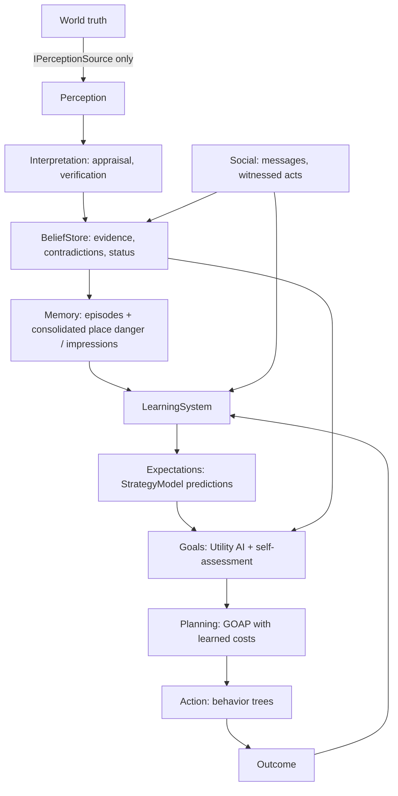

# Cognitive model

Cascade agents run an explicit, modular cognitive loop. No component reads world truth; every arrow below is a controlled interface.

| Stage | Code | Runs |
|---|---|---|
| Perception | `Agents/Perception/PerceptionSystem.cs` | 5/2/1 Hz by LOD |
| Interpretation | appraisal table, hearsay verification in `BeliefStore.Observe` | per percept |
| Beliefs | `Agents/Beliefs/Beliefs.cs` | per percept / message |
| Memory | `Agents/Memory/MemorySystem.cs` | on events |
| Learning | `Agents/Cognition/LearningSystem.cs`, `StrategyModel.cs`, `Experience.cs` | on outcomes only |
| Expectation | `LearningSystem.Predict / Expect` | when a strategy starts or is scored |
| Self-assessment | `Agents/Cognition/SelfAssessment.cs` | at decision time |
| Goals | `Agents/Goals/Goals.cs` | decision ticks + interrupts |
| Planning / action | `Agents/Actions/*` | on goal change / failure |
| History | `Agents/Cognition/CognitiveHistory.cs` | 1 Hz samples + marks |

## What is new in this evolution

- **Experience** as a structured record: context, strategy, expectation, outcome, prediction error, reward, emotion, confidence, social context, place, time, source (Direct / Observed / Reported).
- **Learning** of strategy success per situation, with personality-dependent rates and slow **learned dispositions** (trust bias, risk perception, self-confidence, social expectation, information seeking). Traits never change.
- **Prediction error** as the main learning signal.
- **Belief revision** instead of replacement; **uncertainty** as a first-class quantity.
- **Information seeking** goals (`Verify`, `AskForInfo`) that emerge from doubt × curiosity × confidence.
- **Social learning** from what others visibly do and from what they report.
- **Self-assessment** (knowledge / plan / decision / social confidence) with real consumers.
- **Decision Trace 2.0**, timelines, and a recordable **Lab** for cognitive experiments.

This is a functional model, not a claim of consciousness. Every number is inspectable and every change is logged.
